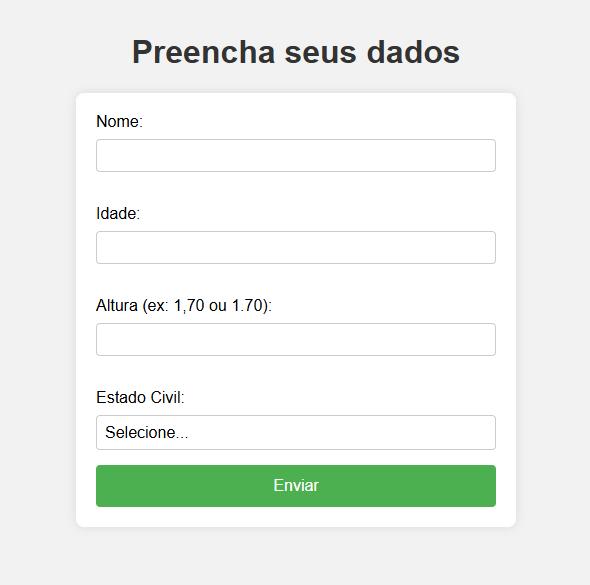

# Flask-Python1

Este é o meu primeiro projeto usando Python com Flask.

Aqui criei uma aplicação simples que recebe dados do usuário via formulário, processa esses dados no backend e mostra uma mensagem personalizada.

Projeto para aprender o básico de Flask, rotas, templates e manipulação de formulários.

---

## Print da aplicação

